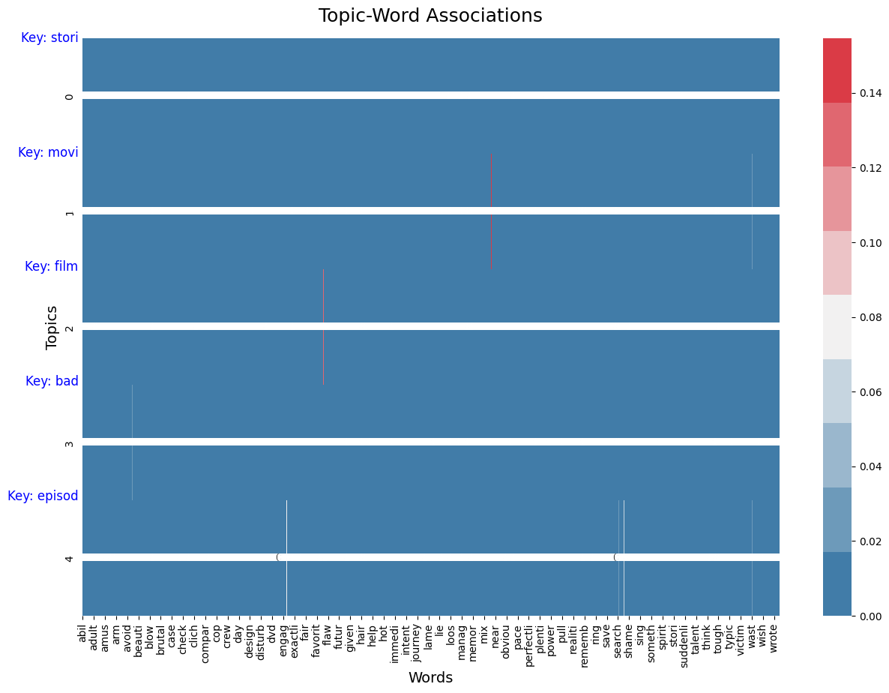
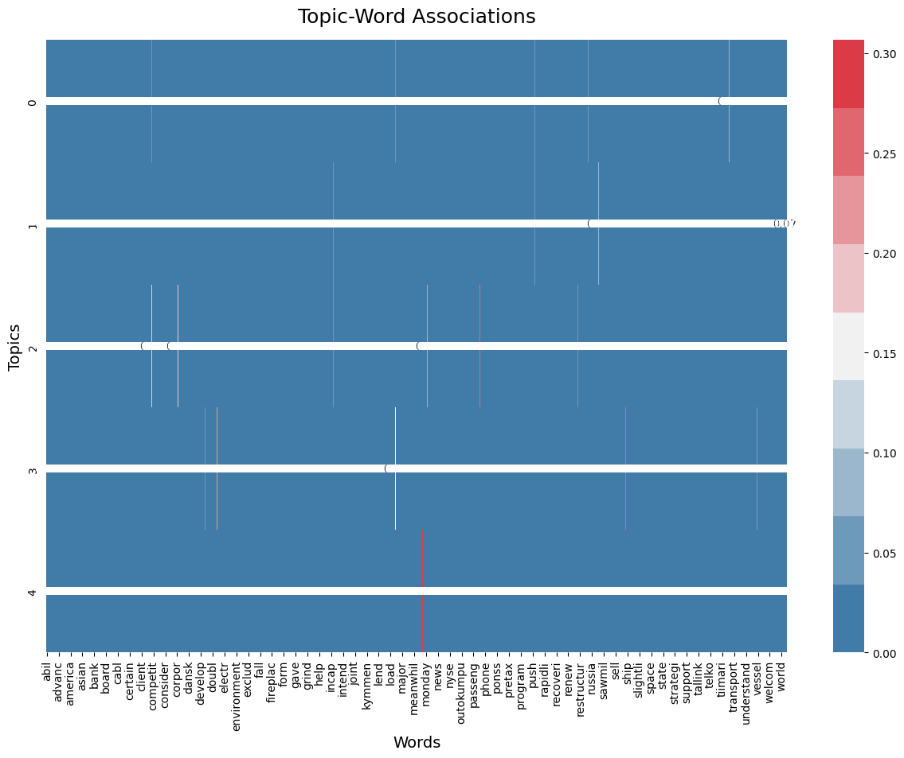

# Smart Review Analyzer and Recommender (SRAR)

## Description
The **Smart Review Analyzer and Recommender (SRAR)** is an advanced Natural Language Processing (NLP) application designed to enhance the analysis of customer reviews. It extracts sentiments, identifies key themes, and generates personalized recommendations, making it an invaluable tool for businesses looking to understand and act on customer feedback.

## Features 
- **Sentiment Analysis**: Classifies reviews into positive and negative sentiments and detects nuanced emotions.
- **Thematic Analysis**: Identifies key themes such as product quality, customer service, or value for money.
- **Personalized Recommendations** *(Upcoming Feature)*: Suggests products or services based on analysis.

*Note: Personalized Recommendations feature is currently under development and will be available in future updates.*

## Installation
Set up the project environment on your machine by following these steps:

1. Clone the repository:
```
git clone https://github.com/HamidrezaGholamrezaei/SRAR.git
```

2. Install the required dependencies:
```
pip install -r requirements.txt
```

## Project Structure
Below is the structure of the SRAR project, outlining the main components and their organization:

```
SRAR/
│
├── src/
│   ├── data_processing/
│   │   ├── init.py
│   │   ├── data_handler.py
│   │   └── data_preprocesser.py
│   │
│   ├── sentiment_analysis/
│   │   ├── init.py
│   │   └── sentiment_analyzer.py
│   │
│   ├── thematic_analysis/
│   │   ├── init.py
│   │   └── thematic_analyzer.py
│   │
│   └── recommendation_system/ # Upcoming Feature
│       ├── init.py
│       └── recommender.py
│
├── tests/
│   ├── init.py
│   ├── test_data_processing.py
│   ├── test_sentiment_analysis.py
│   ├── test_thematic_analysis.py
│   └── test_recommendation_system.py
│
├── data/
│   └── (data files for analysis)
│
├── results/
│   ├── models/
│       └── (trained model files)
│   └── evaluations
│       └── (evaluation results)
├── main.py # Main application script
├── config.py # Configuration settings
├── logs
│   └── (log files)
├── requirements.txt
├── utils.py # Utility functions
└── README.md 
```

This structure is designed to keep the project organized and modular, facilitating easy navigation and further development. Each component is placed within a specific directory, reflecting its role within the project.


## Usage
Execute SRAR from the command line:

- To train the model and analyze a dataset:
```
python main.py --action train --dataset [datafile.csv]
```
Specify the dataset with `--dataset your_dataset.csv`, replacing `your_dataset.csv` with the path to your review dataset. For example:
```
python main.py --dataset imdb
```

- For sentiment prediction on specific text:
```
python main.py --action predict --text "Sample review text"
```

## Results
SRAR delivers insightful analysis on customer reviews, showcasing sentiment classifications, thematic insights, and topic coherences. Below are the example results for two publicly available datasets:

### IMDB Dataset

#### Sentiment Analysis Evaluation Metrics
- **Accuracy**: 0.871
- **Precision**: 0.872
- **Recall**: 0.871
- **F1 Score**: 0.871

#### Thematic Analysis Top Words Per Topic
- **Topic #0**: like realli look thing make peopl good scene think know
- **Topic #1**: movi watch good seen great act time enjoy think like
- **Topic #2**: film seen watch director make act good mani enjoy direct
- **Topic #3**: stori love play charact life perform great role young music
- **Topic #4**: episod seri season watch anim origin best great televis time



#### Average Topic Coherence
- **Coherence Score**: 0.4244 - This suggests that the topics are relatively less distinct, indicating room for improvement in topic separation and clarity.

### Financial Dataset

#### Sentiment Analysis Evaluation Metrics
- **Accuracy**: 0.777
- **Precision**: 0.832
- **Recall**: 0.777
- **F1 Score**: 0.731

#### Thematic Analysis Top Words Per Topic
- **Topic #0**: oper profit total rose loss quarter compar improv fell pretax
- **Topic #1**: year sale increas quarter compani expect said finnish euro earlier
- **Topic #2**: period correspond compar month profit increas respect total loss sale
- **Topic #3**: share earn loss dilut versu quarter rose turn market compar
- **Topic #4**: million percent today euro grew said loss year news profit



#### Average Topic Coherence
- **Coherence Score**: 0.7606 - This higher coherence score suggests better topic distinctiveness, indicating a stronger thematic structure within the financial dataset.

These metrics underscore the effectiveness of SRAR in parsing and analyzing textual data to derive meaningful insights both in terms of sentiment and thematic understanding.

## Running Tests
To run the test suite and validate functionality:
```
python -m unittest discover -s tests
```

## Contributing
Contributions to SRAR are highly appreciated. For bug fixes, feature additions, or documentation improvements, please feel free to open an issue or contact me directly to discuss further. Together, we can make SRAR even better!

## License
SRAR is available as open-source software under MIT license. For more detailed information, please refer to the LICENSE file.
